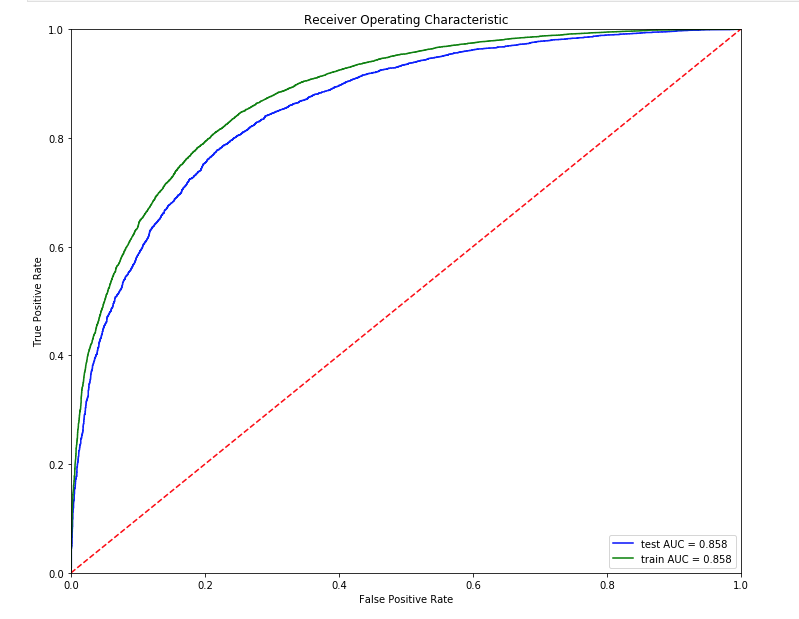
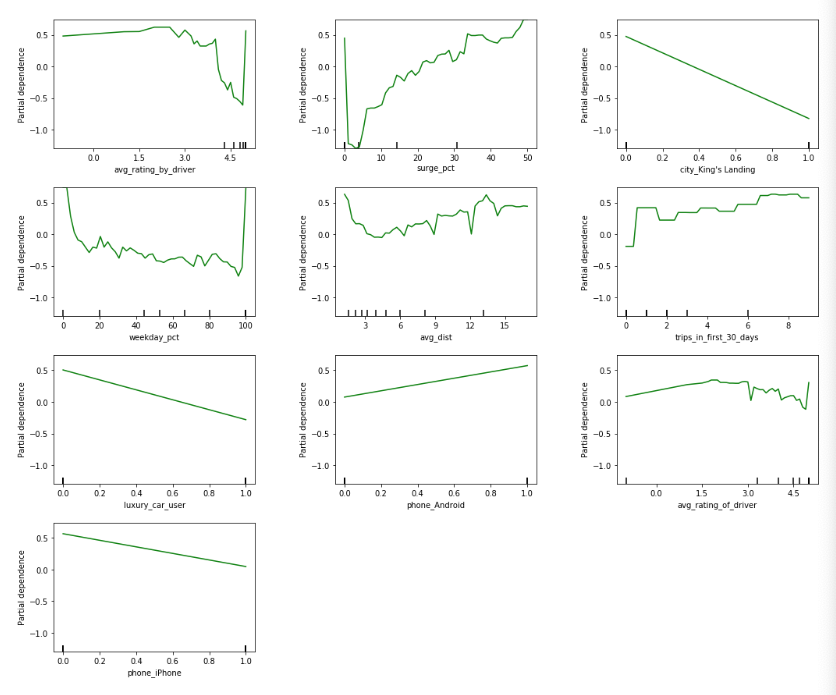

## Case Study

This classification case study required us to use many of the skills we have learned to tackle a real problem in industry. The problem is churn prediction with a ride-sharing company in San Francisco. We worked in small teams to understand the data, develop and tune a strong classification model, and provide actionable business recommendation to prevent customer churn. The necessary code is present in the src directory. The file 'final_run.ipynb' contains the summary and results.

Our final product was a Gradient Boosting model with a ROC AUC score of 0.858. 

This string predictive power was due primarily to the following features:

* Surge percentage
* Phone operating system
* Location

The partial depenence plots show this relationship.

Business recommendations:  

* Consider offering more discounts during surge periods, expecially for new customers
* Develop Android app so it is on par with iOS app
* Explore reasons why riders in King's Landing tend not to churn.